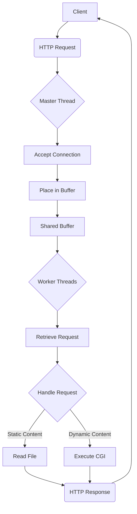
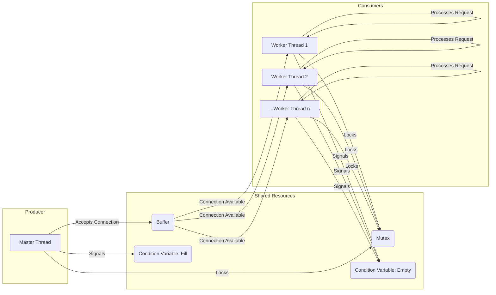

# Concurrent Web Server

This project implements a concurrent HTTP web server in C, designed to handle multiple client requests simultaneously using a thread pool and a producer-consumer model. It extends a basic single-threaded web server by adding concurrency, command-line argument parsing, and different request scheduling policies.

> This project is part of the [OSTEP (Operating Systems: Three Easy Pieces) projects](https://github.com/remzi-arpacidusseau/ostep-projects/tree/master/concurrency-webserver).

## Features

- **Multi-threaded Architecture:** Utilizes a fixed-size thread pool to process incoming HTTP requests concurrently.
- **Producer-Consumer Model:** A master thread accepts new connections (producer) and places them into a shared, fixed-size buffer. Worker threads (consumers) retrieve connections from this buffer and handle the requests.
- **Synchronization:** Employs POSIX mutexes and condition variables (`pthread_mutex_t`, `pthread_cond_t`) to ensure safe access to the shared buffer and prevent race conditions and busy-waiting.
- **Command-Line Argument Configuration:**
  - `-d <basedir>`: Specifies the root directory for serving files (default: current working directory).
  - `-p <port>`: Sets the port number for the server to listen on (default: 10000).
  - `-t <threads>`: Defines the number of worker threads in the pool (default: 1).
  - `-b <buffers>`: Sets the size of the connection buffer (default: 1).
  - `-s <schedalg>`: Determines the scheduling algorithm for requests. Supported values: `FIFO` (First-In, First-Out) and `SFF` (Smallest File First) (default: `FIFO`).
- **Request Scheduling Policies:**
  - **FIFO (First-In, First-Out):** Requests are processed by worker threads in the order they arrive in the buffer.
  - **SFF (Smallest File First):** Worker threads prioritize requests for the smallest files. This is an approximation of Shortest Job First. _Note: The current SFF implementation identifies the smallest file but does not reorder the buffer; it simply picks the smallest available. A more robust implementation would involve reordering or a priority queue._
- **Basic Security:** Includes a check to prevent directory traversal attacks by rejecting requests containing `..` in the file path.
- **HTTP/1.0 Support:** Handles `GET` requests for both static files and dynamic CGI scripts.

## General Workflow

Here's a high-level overview of how the concurrent web server processes requests:



## Producer-Consumer Model

The core concurrency mechanism relies on a producer-consumer pattern for managing connections:



## Project Structure

```
.
├── README.md
└── src/
    ├── io_helper.c
    ├── io_helper.h
    ├── Makefile
    ├── request.c
    ├── request.h
    ├── spin.c
    ├── wclient.c
    └── wserver.c
```

- `wserver.c`: Contains the `main` function for the web server, argument parsing, thread pool creation, and the producer-consumer logic.
- `request.c` / `request.h`: Handles the core HTTP request processing, including parsing URIs, serving static files, and executing CGI scripts.
- `io_helper.c` / `io_helper.h`: Provides wrapper functions for system calls with error checking.
- `wclient.c`: A simple HTTP client used for testing the server.
- `spin.c`: A sample CGI program that simulates a time-consuming task.
- `Makefile`: Automates the compilation process.

## Building the Project

Navigate to the `src` directory and use `make` to compile the server, client, and CGI script:

```bash
cd src
make
```

This will generate the executables: `wserver`, `wclient`, and `spin.cgi`.

To clean the build (remove object files and executables):

```bash
cd src
make clean
```

## Running the Web Server

From the `src` directory, you can run the `wserver` executable with various command-line arguments:

```bash
./wserver [-d basedir] [-p port] [-t threads] [-b buffers] [-s schedalg]
```

**Example:** Run the server with 4 worker threads, a buffer size of 8, and FIFO scheduling on port 10000:

```bash
./wserver -p 10000 -t 4 -b 8 -s FIFO &
```

- The `&` at the end runs the server in the background.
- You can choose any available port number (e.g., 8000, 20000). Ports below 1024 are reserved.

## Testing the Web Server

Use the provided `wclient` executable to send requests to your running server. Open a new terminal and navigate to the `src` directory.

**Syntax:**

```bash
./wclient <host> <port> <filename>
```

**Examples:**

1.  **Requesting a static file (e.g., the project's `README.md` from the parent directory):**

    ```bash
    ./wclient localhost 10000 /../README.md
    ```

    _Expected Output (truncated):_

    ```
    Header: HTTP/1.0 200 OK
    Header: Server: OSTEP WebServer
    Header: Content-Length: 21207
    Header: Content-Type: text/plain
    # Overview
    ...
    ```

2.  **Requesting a dynamic CGI script (e.g., `spin.cgi`):**

    ```bash
    ./wclient localhost 10000 /spin.cgi
    ```

    _Expected Output:_

    ```
    Header: HTTP/1.0 200 OK
    Header: Server: OSTEP WebServer
    Header: Content-Length: 126
    Header: Content-Type: text/html
    <p>Welcome to the CGI program ()</p>
    <p>My only purpose is to waste time on the server!</p>
    <p>I spun for 0.00 seconds</p>
    ```

3.  **Testing the security feature (attempting directory traversal):**

    ```bash
    ./wclient localhost 10000 /.././../etc/passwd
    ```

    _Expected Output (truncated, indicating Forbidden access):_

    ```
    Header: HTTP/1.0 403 Forbidden
    Header: Content-Type: text/html
    Header: Content-Length: 160

    <!doctype html>
    <head>
      <title>OSTEP WebServer Error</title>
    </head>
    <body>
      <h2>403: Forbidden</h2>
      <p>server could not read this file: /.././../etc/passwd</p>
    </body>
    </html>
    ```

## Known Issues / Future Improvements

- **`sprintf` Buffer Overflows:** The compiler generates warnings regarding potential buffer overflows with `sprintf` in `request.c`, `wclient.c`, and `spin.c`. While these do not prevent functionality for typical use cases, they could lead to issues with extremely long inputs. Using `snprintf` would be a safer alternative.
- **SFF Implementation:** As noted, the SFF implementation is simplified. A more robust solution would involve a priority queue or actual reordering of the buffer to ensure the smallest file is always served next.
- **Error Handling:** The server uses `_or_die` wrappers, which exit on error. More graceful error handling could be implemented for production-grade robustness.

## License

This project is based on the OSTEP (Operating Systems: Three Easy Pieces) course material. Please refer to the original course for licensing information.
